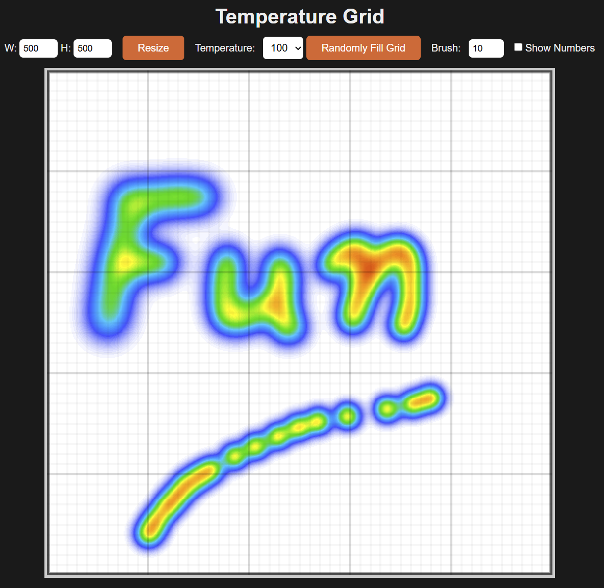

# Heat Diffusion Grid

A browser-based heat diffusion sandbox on a large paintable grid. Set temperatures, paint hot/cold areas, randomize the field, and watch heat spread in real time.

Try here: [https://farazpu.github.io/temperature_grid_fun/](https://farazpu.github.io/temperature_grid_fun/)

## Features

- 2D temperature grid (`10x10` to `1000x1000`)
- Paint tool with adjustable brush radius
- Temperature picker (`1-100`) plus quick modifiers:
  - `Shift + drag` = paint `0` (cold)
  - `Ctrl + drag` = paint `50` (mid)
- Random fill button
- Optional number overlay
- Two simulation strategies:
  - `simulation.js`: neighbour transfer model
  - `simulation2.js`: Laplacian diffusion with float-state accumulation

## Run

No build step required.

1. Open `index.html` in a browser.
2. Interact with the controls and paint on the canvas.

## Switch Simulation

In `index.html`, change the script include near the bottom:

- Default:
  - ``
- Alternative:
  - ``

## Project Files

- `index.html` — UI, rendering, controls, game loop
- `simulation.js` — original heat-transfer implementation
- `simulation2.js` — alternative diffusion implementation
